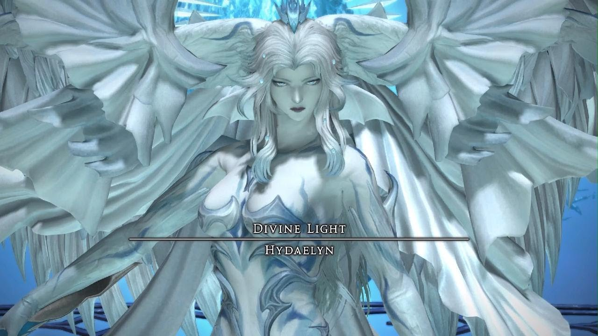
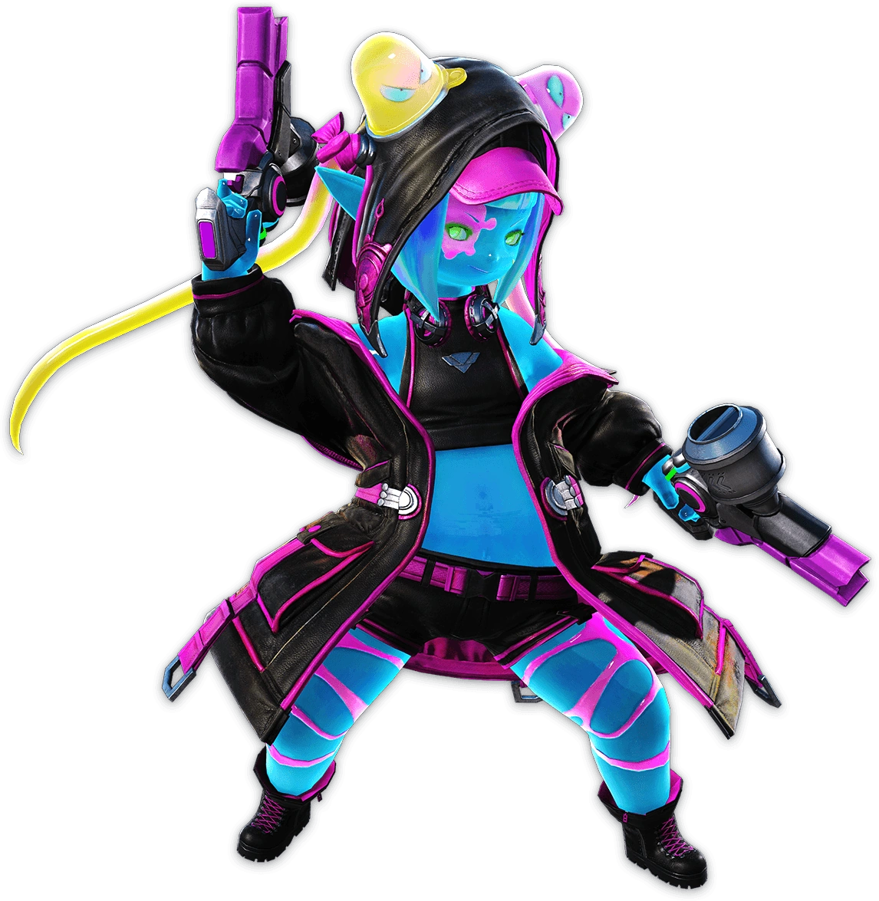
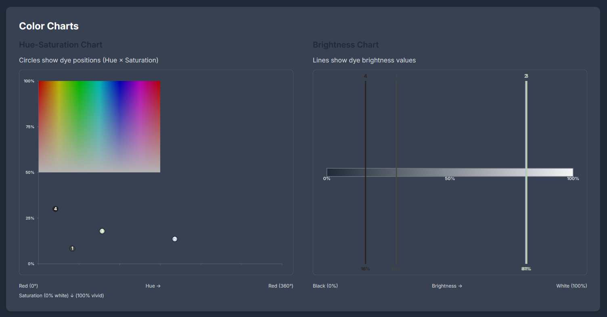
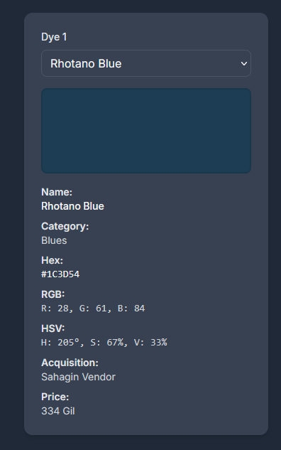

# Feedback for the Current Build of XIV Dye Tools

## Overall Feedback

* **ANOMALY**: On some tools, the Tools drop down menu is linking the experimental versions of other tools instead of stable versions.

  * Tools drop down for ALL tools should point to the Stable versions.
  * **SUGGESTION**: What if the drop-down menu was a separate component (probably a separate .js file) and each tool references this menu by just loading the script?

* **SUGGESTION**: Style Sheet Data should be in a separate styles.css file.

  * This is so that all current and future tools can use the same consistent colors

* **SUGGESTION:** Can the Social Media Links and Footer text also go in a separate file which will be referenced by current and future tools?

  * This is so if we need to edit this text, we can just edit one file and all the tools will reflect this new text.
  * (At this point, I'm thinking about old-school SHTML techniques, but I'm sure newer technologies have superseded SHTML)

* **NEW FEATURE**: Different Dark Mode and Light Mode themes!

  * Six New Themes!

    * **Three Light Mode themes:**
      * Standard Light: Jet Black Text over Pure White Background with Light Grey container boxes.
      * Hydaelyn: Dark blue text over light blue background and light grey container boxes, inspired by  Hydaelyn. See image: 
      * Parchment: Dark colored text over a beige/off-white background, similar to parchment paper.
    * **Three Dark Mode themes:**
      * Standard Dark: Pure White Text over Jet Black Background with Dark Grey container boxes.
      * Classic Final Fantasy: White/Light-Blue text over bluish hues inspired by Classic Final Fantasy games
      * Sugar Riot: Pink over dark backgrounds. Inspired by the Sugar Riot raid boss from the Arcadion raid series. See image: 
    * All themes use dye colors that exist in FFXIV!
    * All themes are WCAG (AA minimum, AAA ideal) Compliant.
    * Default Mode: Standard Light 

    

  ### FONT FORMATTING CHANGES

  * Fonts:

    * Tool Title Font Face: "Cinzel Decorative"

      * ```
        font-variant-caps: small-caps;
        ```

    * H1 Header Font Face: "Cinzel SemiBold 600"

      * ```
        font-variant-caps: all-small-caps;
        ```

    * H2 and H3 Headers Font Face: "Cinzel Medium 500"

      * ```
        font-variant-caps: small-caps;
        ```

    * Bolded Headers (such as the bolded headers used in the Dye Boxes in the Dye Comparison Tool): "Lexend Giga" 

      * ```
        font-variant-caps: all-small-caps;
        ```

    * All Numbers: "Habibi"

      * Is there a CSS property where the font styling only applies to numbers? How would this work?

    * General Body Font Face: "Lexend"

    * All fonts are from Google Fonts Repository and can be embedded using Google Fonts API.

## Color Matcher

* BUG: The Color Matcher doesn't seem to resolve colors close to Jet Black (#1e1e1e), despite having the "Exclude Pure White & Jet Black" option disabled.
  * Entering color #000000 matches to Gunmetal Black (\#181820) when it should match to Jet Black.
  * Meanwhile, entering #1e1e1e in the color picker will match to Dark Brown (#28211C)
  * Pure White is not affected by this anomaly.


## Dye Comparison Tool

* BUG: Only the NW quarter of the Hue-Saturation Chart is being rendered. We need to fix this so the complete Hue-Sat chart is fully rendered. See image below:



# NEW TOOL: Dye Mixer!

## How it Works

1. User selects two dyes:

   * A horizontal gradient line appears

   * Dye 1 will be in the 0% position

   * Dye 2 will be in the 100% position

2. User asks for recommended dyes:

   * Default: 3 dyes (not counting the dyes in the 0% and 100% positions)

     * Dye closest to the 25%, 50%, and 75% positions
     * Information boxes will generate displaying information.
       * Information box resembles the boxes used in the Dye Comparison tool. See image: 
       * Information box will also display a Deviance Rating, which follows the same logic that the Deviance Rating used in the Harmony Explorer.

   * 4 dyes: 20%, 40%, 60%, 80% positions

   * 7 dyes: 12.5%, 25%, 37.5%, 50%, 62.5%, 75%, 87.5% positions

   * The recommended dyes setting would generate positions equidistant from each other.

     * ```
       Percent Distance between Dyes on Spectrum = 100 / (Recommended Dyes + 1)
       - For example: 20% = 100 / (4 Recommended Dyes + 1)
       ```

   * Maximum: 9 dyes (10% minimum distance between displayed dyes)

   * Deduplication logic should be implemented if one dye occupies more than one position.

   * A warning should display if the user chooses the same dye for both 0% and 100% positions.

3. Universalis API allows for fetching of dye prices.
